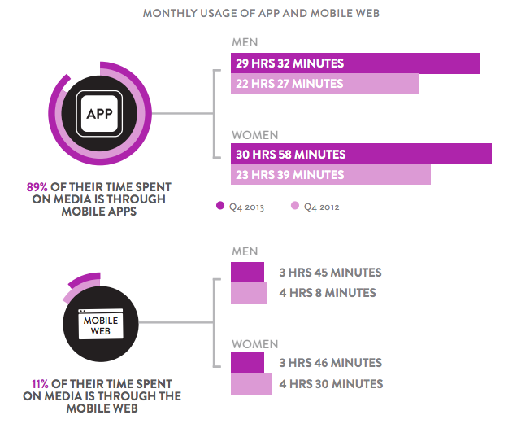

autoscale: true
slidenumbers: true
footer: *ASO - App Store Optimization* - © Matteo Crippa / :rocket: *[boostco.de](http://boostco.de)* - 2016

# [fit] ASO
# in :pill:

---

# :spaghetti: Ma parla come mangi! :spaghetti:

---

# ASO
## *App Store Optimization*

---

# I numeri del mobile :calling:

---

# :computer: Desktop vs Mobile :iphone:

> more Google searches take place on mobile devices than on computers in 10 countries including the US and Japan.
-- Google[^1]

[^1]: fonte: comscore.com

---

# Web vs Mobile

fonte: Nielsen

---

# Apple vs Google
## *Analisi degli App Store*

---

# Apple App Store

* App: **+2,000,000** uniche [^2]
* Piattaforme: iOS + WatchOS, tvOS
* Promozione: Search Ads :new:
* Accessibilità: web (solo consultazione), mobile, iTunes

[^2]: fonte: statista.com

---

# Google Play Store

* App: **+2,200,000** uniche [^3]
* Piattaforme: Solo Android, ma compatibili con Chromecast
* Promozione: esterna allo store (Adwords)
* Accessibilità: web (installazione remota), mobile

[^3]: fonte: statista.com

---

# ASO
## *... e in soldoni? :euro::euro::euro:*

---

# :mag: Come trovo la mia App? 1/2

Se prendiamo l'App Store di Apple da mobile abbiamo essenzialmente **5** modi di accedere ad un App:

- **Homepage in primo piano** (banner in alto), definiti dallo staff dello store;
- **Homepage**, definiti dallo staff dello store;
- **Categorie/Classifiche**, ordinata per download/feeaback;
- **Ricerca**;
- **Link diretto**;

---

# :mag: Come trovo la mia App? 2/2

Escludendo i primi 2 modi, l'**ASO** agisce sui 3 rimanenti:
- **Categorie/Classifiche**;
- **Ricerca**;
- **Link diretto**;

---

# ASO
## :confetti_ball: *come ottimizziamo?* :confetti_ball:

---

# un po' di SEO e SMM

Ogni **App** ha un link web, quindi perché non aiutarci con un po' di **SEO** e **SMM**?

- **inbound linking** e **article marketing** sul link dell'App;
- **short link** dedicati per le app e **qrCode**;
- **account social** dedicati per l'App che rimandano al link;

---

# :bar_chart: e Analytics...

**Apple** e **Google** forniscono dei tool dedicati per l'analisi del traffico sugli store, entrambi i tool sono molto giovani, ma offrono davvero molte informazioni utili:

- numero di visite alla pagina dell'applicazione, segmentendo la sorgente (web, mobile);
- analitiche per area geografica;
- canalizzazione dalla visita, al tap per l'installazione dell'App;

---

# Commenti e voti :loudspeaker:

Una componente importante degli store riguarda il **ranking**.
Un'App con molti voti positivi e' sicuramente meglio apprezzata dagli utenti, una componente del **ASO** deve essere sicuramente rivolta a questo aspetto:

- Analizzare i feedback degli utenti;
- Comunicare con gli sviluppatori per evidenziare problematiche e trovare soluzioni;

---

# e il Re :crown: contenuto?

Non ce lo siamo dimenticati, sicuramente ottimizzare la **pagina dell'applicazione** e' molto importante, ecco quali aspetti non vanno sottovalutati:

- Nome dell'applicazione, utilizzando le giuste keywords;
- Descrizione dell'applicazione, ricordandosi che di base solo tre righe del contenuto vengono mostrate, le succesive sono visibili sono dopo un tap;
- Le immagini, essenziali, ma anche i video utiltimamente per mostrare una preview del prodotto;
- Le keywords, da gestire, non abusare e localizzare;
- Appena accennata, la localizzazione, l'App Store e' aperto al mondo quindi meglio abbondare in localizzazioni;

---

# Limitazioni :bangbang:

Una potenziale limitazione riguarda l'**A/B split testing**, la natura degli store e la necessità del rilascio di una nuova versione dell'App nel caso di Apple, rendono difficile poter effettuare testing sulle pagine delle App.

Non possiamo integrare altri sistemi di analytics sulle pagine.

---

# [fit] Vuoi approfondire l'*ASO* *?*
## 
## *Contatta i nostri esperti!*
### *[boostco.de](http://boostco.de)*
