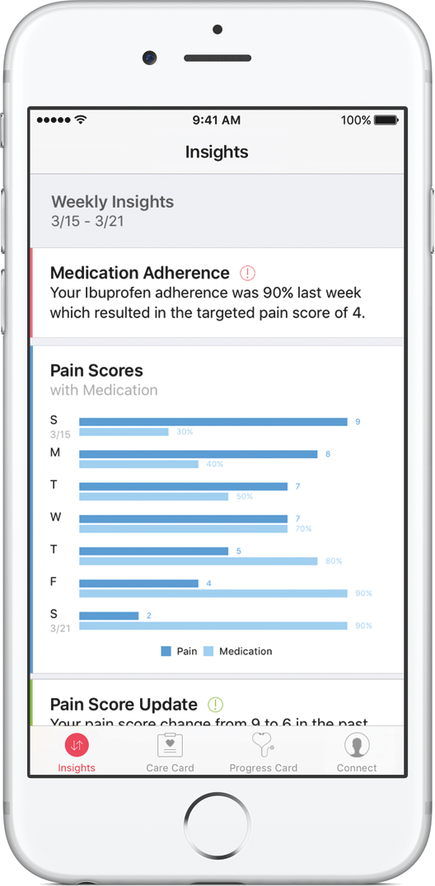

autoscale: true
slidenumbers: true
footer: *#carekitwebinar* - © Matteo Crippa / :rocket: *[boostco.de](http://boostco.de)* - 2016

### an introduction to
## [fit] **_CareKit_**
### &
## [fit] **_ResearchKit_**

---

## [fit] Matteo Crippa
*iOS* __dev__ since *2.2* & *CareKit* and *ResearchKit* __advocate__
:rocket: *[boostco.de](http://boostco.de)* __founder__ 

## twitter: *__@ghego20__* / in: *__matteocrippamc__*

---

## [fit] 2014
## _WWDC_

---

# __*HealthKit*__
### provides _api_ and _storage_
#### for health data.

---

## [fit] 2015
## _April_

---

# __*ResearchKit*__
### connects _researchers_ and _developers_
#### with a new approach in clinical research.

---

## [fit] 2016
## _April_

---

# __*CareKit*__
### connects _patients_, _caregivers_ and _physicians_
#### improving everyone's life.

---

# __*#HealthKit*__

---

# HealthKit
- *dashboard (Health app)*
- *medical ID*
- *data storage*
- *api*

---

---

# __*#ResearchKit*__

---

# ResearchKit / __*benefits*__
- *wider reach*
- *driven data*
- *continuous stream of data*
- *real-time feedback from/to participants*

---

# ResearchKit / __*in numbers*__
# [fit] *+80k :family:*
subscribers in *7* months

---

# ResearchKit / __*in numbers*__
# [fit] *+10k :family:*
subscribers in *24* hours for *[myHeart Counts](https://itunes.apple.com/WebObjects/MZStore.woa/wa/viewSoftware?id=972189947&mt=8&ls=1&v0=www-us-researchkit-itms-my-heart)* app

---

# ResearchKit / __*month 1 drop*__

> more than **50%** of the initial subscribers
> continue using the app after **1 month**.
-- [ResearchKit Blog](http://researchkit.org/blog.html#article-2)

---

# __*ResearchKit*__

[Github/ResearchKit](github.com/ResearchKit)

---

# ResearchKit
### [fit] __*3 modules*__

---

# ResearchKit / __*Consent*__

Partecipants in research or clinical studies are ofter asked to share sensitive data, this module provides an easy and flexible templating system for enrollment: 
- *multiple template section (__NDA, privacy, data usage, etc.__)*
- *signature management*
- *pdf generator*

---

# ResearchKit / __*Survey*__

Provides a predefined user interface to build surveys: 
- *defining questions*
- *type of answers (__single, multiple, image, etc.__)*
- *optional tasks*
- *easy to localize*

---

# ResearchKit / __*Active tasks*__

- *semi-controlled test*
- *iPhone sensors*
- *third party hardware (__eg. fit bands__)*

---

# ResearchKit / __*Mix data*__

- *user anwers*
- *iPhone sensors (__eg. gyroscope, etc.__)*
- *third party sensors (__eg. fit bands, etc.__)*
- *big data (__eg. weather, pollution, etc.__)*

---

# ResearchKit / __*Android*__

[Github/ResearchStack](github.com/ResearchStack)

---

# ResearchKit / __*No backend*__

Apple doesn't provide any specific backend for ResearchKit apps and it is out of scope of the project.

Feel free to user your already existing one or develop a new dedicated from scratch.

---

*[download app](https://itunes.apple.com/us/app/dogkit/id1109761639?mt=8)*
[download source code](https://github.com/boostcode/ResearchKit-ColorBlind)

---

# __*#CareKit*__

---

# [fit] is *species* agnostic
# :man: :dog: :cat: :tulip:

---
# __*CareKit*__

[Github/CareKit](https://github.com/carekit-apple/CareKit)

---

# CareKit
### [fit] __*6 modules*__

---

# CareKit / __*Care Card*__

- *interactive dashboard of tasks*

- *tracks treatment tasks (__eg. taking medication or performing physical exercises__)*

- *each task can be defined with custom:*
 - schedule
 - reference color
 - description

---

# CareKit / __*Symptom*__

- *interactive dashboard*

- *tasks are built on top of* ResearchKit *surveys*

- *each task can be composed by more than a question*

- *tasks can be connected to sensors or third party devices*

---

# CareKit / __*Insights*__

- *charts showing relations between treatments and progress*
- *tips or alert to suggest patients to stay on track with their health goals*

---

# CareKit / __*Connect*__

- *contacts manager (__CRUD and categories__)*
- *share insights data*

---

# CareKit / __*Care plan store*__

- *Stores all the data displayed by* Care Card *and* Progress Card

- *It updates the UI in a reactive way*

- encrypted*, by default*

---

# CareKit / __*Documents*__

- *Generate custom reports with* graphs *and information from the insights*
- HTML *and* PDF *supported formats*

---

*[download dogKit](https://itunes.apple.com/us/app/dogkit/id1109761639?mt=8)*

---

# [fit] dogKit / __*1st CareKit app for :dog:*__

---

# [fit] Q*&*A *?*

---

## 
### *[boostco.de](http://boostco.de)*
