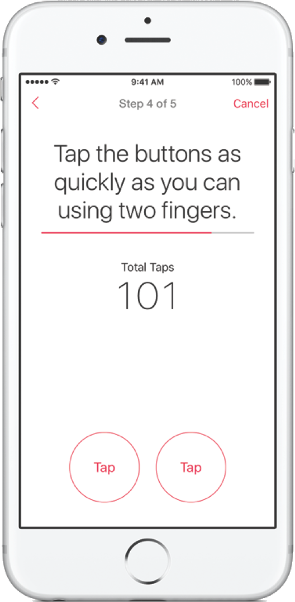

footer: An introduction to CareKit & ResearchKit © Matteo Crippa / *[boostco.de](http://boostco.de)* 2016
slidenumbers: true

## [fit] an introduction to
# [fit] **_CareKit_**
## [fit] &
# [fit] **_ResearchKit_**

---

## [fit] Matteo Crippa
## *__@ghego20__*
iOS Dev since 2.2 & CareKit and ResearchKit advocate
[boostco.de](http://boostco.de) founder

---

## [fit] 2014
## _WWDC_

---

# __*HealthKit*__
### provides _api_ and _storage_
#### for health data.

---

## [fit] 2015
## _April_

---

# __*ResearchKit*__
### connects _researchers_ and _developers_
#### with a new approach in clinical research.

---

## [fit] 2016
## _April_

---

# __*CareKit*__
### connects _patients_, _caregivers_ and _physicians_
#### improving everyone's life.

---

# HealthKit
- *dashboard (thx to Health app)*
- medical ID
- *data storage*
- api

---

# __*ResearchKit*__

---

---

# ResearchKit / __*what's new?*__
__*Mobile app based approach allows you to have:*__
- wider reach
- *driven data*
- continuous stream of data
- *feedback from participants*

---

# ResearchKit / __*in numbers*__
# [fit] *+80k*
subscribers in *7* months

---

# ResearchKit / __*in numbers*__
# [fit] *+10k*
subscribers in *24* hours for [MyHeart Counts](https://itunes.apple.com/WebObjects/MZStore.woa/wa/viewSoftware?id=972189947&mt=8&ls=1&v0=www-us-researchkit-itms-my-heart)

---

# ResearchKit / __*month 1 drop*__

> more than **50%** of the initial subscribers
> continue using the app after **1 month**.
-- [ResearchKit Blog](http://researchkit.org/blog.html#article-2)

---

# __*ResearchKit*__

[Github/ResearchKit](github.com/ResearchKit)

---

# ResearchKit
### [fit] __*3 modules*__

---

# ResearchKit / __*Consent*__

- onboarding survey
- signature management
- pdf generator

---

# ResearchKit / __*Survey*__

- single || multiple answers
- complex forms
- optional tasks

---

# ResearchKit / __*Active task*__

- semi-controlled test
- device sensors
- third party hardware

---

# ResearchKit / __*Mix data*__

- user surveys
- device sensors (eg. gyroscope, etc.)
- third party sensors (eg. fit bands, etc.)
- big data

---

# ResearchKit / __*Android*__

[Github/ResearchStack](github.com/ResearchStack)

---

# __*CareKit*__

---

# __*CareKit*__

[Github/CareKit](https://github.com/carekit-apple/CareKit)

---

# CareKit
### [fit] __*6 modules*__

---

# CareKit / __*Care Card*__

- *interactive dashboard*

- *tracks treatment (eg. taking medication or performing physical exercises)*

---

# CareKit / __*Symptom*__

- *dashboard*

- *built on top of* ResearchKit *surveys*

---

# CareKit / __*Insight*__

*tracks treatment (eg. taking medication or performing physical exercises)*

---

# CareKit / __*Connect*__

*tracks treatment (eg. taking medication or performing physical exercises)*

---

# CareKit / __*Care plan store*__

- *Stores all the data displayed by* Care Card *and* Progress Card*.*

- *It provides reactive information to UI.*

- *It is* encrypted *by default.*

---

# CareKit / __*Document exporter*__

*Allows you to export data in* HTML *or* PDF *format, creating custom template based documents with graphs.*

---

## 
### *[boostco.de](http://boostco.de)*
